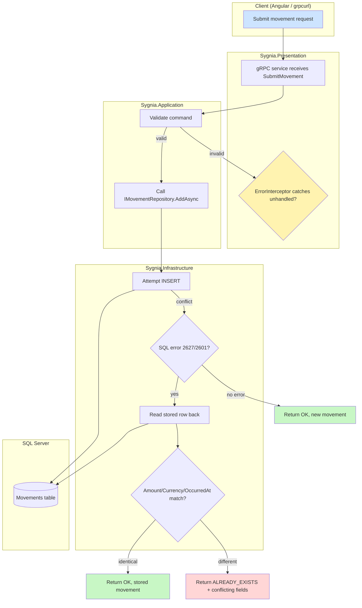
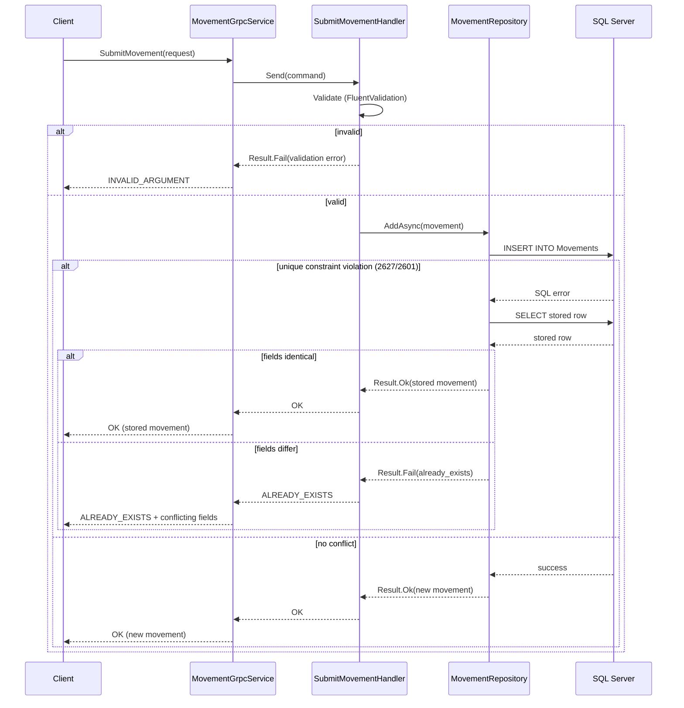

# Design Manual (docx) Implementation Plan

> **For agentic workers:** REQUIRED SUB-SKILL: Use superpowers:subagent-driven-development (recommended) or superpowers:executing-plans to implement this plan task-by-task. Steps use checkbox (`- [ ]`) syntax for tracking.

**Goal:** Produce `docs/Sygnia-Design-Manual.docx`, a professionally formatted document explaining the tech stack and implementation to both a junior developer and a non-technical stakeholder, including a swimlaned/colored activity diagram and a sequence diagram built via the Figma draw.io-equivalent MCP tooling available in this environment.

**Architecture:** Diagrams are authored first (as Mermaid, then rendered/exported), then assembled into a docx via a Python script (python-docx) run locally, since there is no draw.io MCP server registered in this environment — the closest available tool is the `figma:figma-generate-diagram` skill (Mermaid-based diagrams in FigJam) or plain Mermaid rendered to PNG. This substitution must be recorded in `SOLUTION.md`.

**Tech Stack:** Mermaid (activity + sequence diagrams), python-docx (document assembly), existing content from `docs/first_draft.md`, `docs/SOLUTION.md`, and root `CLAUDE.md`.

**Spec:** `docs/project-scaffold-done.md` Modifications item 10.

## Global Constraints

- No `draw.io` MCP server is currently registered (checked the available MCP server list) — use Mermaid diagrams rendered to PNG/SVG as the substitute, and record this substitution explicitly in `SOLUTION.md`, matching CLAUDE.md's rule that transport/tooling substitutions get documented there.
- Audience is dual: a junior developer (needs concrete detail — class names, RPC names, the two invariants) and a non-technical stakeholder (needs plain-language framing — no jargon without a one-line explanation).
- Diagrams must be swimlaned (activity diagram) and use color to distinguish process types, per the spec.
- Output lands in `docs/Sygnia-Design-Manual.docx`.

---

### Task 1: Draft the document outline and content

**Files:**
- Create: `docs/superpowers/plans/manual-outline.md` (working draft, source of truth for Task 4's script)

**Interfaces:** None — content authoring.

- [ ] **Step 1: Pull source content** from `docs/first_draft.md`, `docs/SOLUTION.md`, and root `CLAUDE.md` — the two invariants (idempotency, streaming), architecture diagram (textual), tech stack list, deliberate scope omissions.

- [ ] **Step 2: Write the outline** with these sections, each with a one-paragraph non-technical summary followed by technical detail:
  1. Executive summary (non-technical: what the system does — record and query account movements safely)
  2. Tech stack (table: layer → technology → why)
  3. Architecture (Clean Architecture layers, dependency direction)
  4. The two invariants (idempotency via composite PK; end-to-end streaming) — this is the section a junior developer most needs
  5. Activity diagram (submit-movement flow, swimlanes: Client / Presentation / Application / Infrastructure / Database)
  6. Sequence diagram (a single `SubmitMovement` call end to end)
  7. Deliberate scope omissions and why
  8. Known limitations / next steps

- [ ] **Step 3: Save the outline** to `docs/superpowers/plans/manual-outline.md`.

- [ ] **Step 4: Commit**

```bash
git add docs/superpowers/plans/manual-outline.md
git commit -m "docs: draft outline for the design manual"
```

---

### Task 2: Build the activity diagram (swimlanes, colored)

**Files:**
- Create: `docs/diagrams/activity-submit-movement.mmd`
- Create: `docs/diagrams/activity-submit-movement.png` (rendered export)

**Interfaces:**
- Consumes: the submit-movement flow described in root `CLAUDE.md`'s "Idempotency lives in the database" section
- Produces: a PNG embedded by Task 4

- [ ] **Step 1: Write the Mermaid flowchart with subgraphs as swimlanes**



- [ ] **Step 2: Render to PNG**

Use the `figma:figma-generate-diagram` skill (Mermaid → FigJam) if a visual export is needed, or render locally with `mmdc` (mermaid-cli) if installed: `mmdc -i docs/diagrams/activity-submit-movement.mmd -o docs/diagrams/activity-submit-movement.png -b white`.
Expected: a PNG file exists with swimlanes visible and colored outcome nodes (green = success, red = conflict, yellow = error path).

- [ ] **Step 3: Commit**

```bash
git add docs/diagrams/activity-submit-movement.mmd docs/diagrams/activity-submit-movement.png
git commit -m "docs: add swimlaned activity diagram for submit-movement flow"
```

---

### Task 3: Build the sequence diagram

**Files:**
- Create: `docs/diagrams/sequence-submit-movement.mmd`
- Create: `docs/diagrams/sequence-submit-movement.png`

**Interfaces:**
- Consumes: same submit-movement flow as Task 2, at message-passing granularity
- Produces: a PNG embedded by Task 4

- [ ] **Step 1: Write the Mermaid sequence diagram**



- [ ] **Step 2: Render to PNG** using the same approach as Task 2 Step 2.

- [ ] **Step 3: Commit**

```bash
git add docs/diagrams/sequence-submit-movement.mmd docs/diagrams/sequence-submit-movement.png
git commit -m "docs: add sequence diagram for submit-movement flow"
```

---

### Task 4: Assemble the docx

**Files:**
- Create: `scripts/build-manual.py`
- Create: `docs/Sygnia-Design-Manual.docx` (generated output, committed as a binary deliverable)

**Interfaces:**
- Consumes: `docs/superpowers/plans/manual-outline.md` (Task 1), `docs/diagrams/activity-submit-movement.png` (Task 2), `docs/diagrams/sequence-submit-movement.png` (Task 3)
- Produces: `docs/Sygnia-Design-Manual.docx`

- [ ] **Step 1: Write the assembly script**

```python
"""Builds docs/Sygnia-Design-Manual.docx from the outline and diagram images."""
from docx import Document
from docx.shared import Inches, Pt
from docx.enum.text import WD_ALIGN_PARAGRAPH

doc = Document()

title = doc.add_heading("Sygnia — Design Manual", level=0)

doc.add_heading("1. Executive Summary", level=1)
doc.add_paragraph(
    "Sygnia is a system for recording and querying account movements "
    "(deposits, withdrawals, transfers) with two guarantees: submitting "
    "the same movement twice never creates a duplicate, and querying a "
    "large account statement never runs the server out of memory."
)

doc.add_heading("2. Tech Stack", level=1)
table = doc.add_table(rows=1, cols=3)
table.style = "Light Grid Accent 1"
hdr = table.rows[0].cells
hdr[0].text, hdr[1].text, hdr[2].text = "Layer", "Technology", "Why"
for layer, tech, why in [
    ("API", "gRPC (.NET 8)", "Strongly typed contracts, native streaming for statements"),
    ("Database", "SQL Server + EF Core 8", "Composite primary key enforces idempotency at the DB layer"),
    ("Frontend", "Angular 18 (gRPC-Web)", "Streams statement rows to the browser as they arrive"),
    ("Observability", "Serilog -> Seq, OpenTelemetry -> Jaeger", "Structured logs and distributed tracing"),
    ("Legacy bridge", ".NET Framework 4.8 WCF gateway", "Lets a legacy NetTcp client read the same balances"),
]:
    row = table.add_row().cells
    row[0].text, row[1].text, row[2].text = layer, tech, why

doc.add_heading("3. Architecture", level=1)
doc.add_paragraph(
    "Clean Architecture, dependencies pointing inward only: "
    "Presentation -> Application -> Domain, Infrastructure -> Application -> Domain."
)

doc.add_heading("4. The Two Invariants", level=1)
doc.add_paragraph(
    "These two rules are what the assignment grades, and both fail silently if violated."
)
doc.add_heading("4.1 Idempotency lives in the database", level=2)
doc.add_paragraph(
    "The composite primary key (AccountId, ExternalRef) is the idempotency mechanism. "
    "The code always attempts the INSERT first; a duplicate key error is caught and "
    "resolved by comparing the stored row to the new submission."
)
doc.add_heading("4.2 Statements stream end to end", level=2)
doc.add_paragraph(
    "A single .ToListAsync() anywhere on the statement path would defeat this "
    "requirement while every functional test still passed. Rows flow from EF Core's "
    "AsAsyncEnumerable(), through the gRPC server stream, to the browser, one row at a time."
)

doc.add_heading("5. Activity Diagram — Submit Movement", level=1)
doc.add_picture("docs/diagrams/activity-submit-movement.png", width=Inches(6.5))

doc.add_heading("6. Sequence Diagram — Submit Movement", level=1)
doc.add_picture("docs/diagrams/sequence-submit-movement.png", width=Inches(6.5))

doc.add_heading("7. Deliberate Scope Omissions", level=1)
doc.add_paragraph(
    "Redis, Swagger, and GitHub Pages were considered and cut as not required to "
    "satisfy the assignment brief; MediatR was scoped to Sygnia.Application only."
)

doc.add_heading("8. Known Limitations / Next Steps", level=1)
doc.add_paragraph(
    "No maker/checker approval flow. Balance is computed on read rather than "
    "materialised. Currency codes are not case-normalised."
)

doc.save("docs/Sygnia-Design-Manual.docx")
print("Wrote docs/Sygnia-Design-Manual.docx")
```

- [ ] **Step 2: Install the dependency and run the script**

Run: `pip install python-docx` then `python scripts/build-manual.py`
Expected: `docs/Sygnia-Design-Manual.docx` is created without errors.

- [ ] **Step 3: Open and visually verify** the docx has both images rendered correctly, headings formatted, and the table is legible.

- [ ] **Step 4: Record the draw.io substitution in SOLUTION.md**

Add a line under "Deliberate scope omissions" or a new subsection noting: no draw.io MCP server was available in this environment, so diagrams were authored as Mermaid and rendered to PNG for embedding instead.

- [ ] **Step 5: Commit**

```bash
git add scripts/build-manual.py docs/Sygnia-Design-Manual.docx docs/SOLUTION.md
git commit -m "docs: generate Sygnia design manual docx with activity and sequence diagrams"
```

---

## Self-review notes

- The spec asked for draw.io specifically; no draw.io MCP tool is registered in this session's tool list, so Task 2/3 substitute Mermaid + PNG export and Task 4 Step 4 documents that substitution explicitly, per CLAUDE.md's rule that transport/tooling substitutions get recorded in SOLUTION.md.
- Both audiences (junior dev, non-technical stakeholder) are addressed per-section: each technical section opens with a plain-language paragraph before detail.
